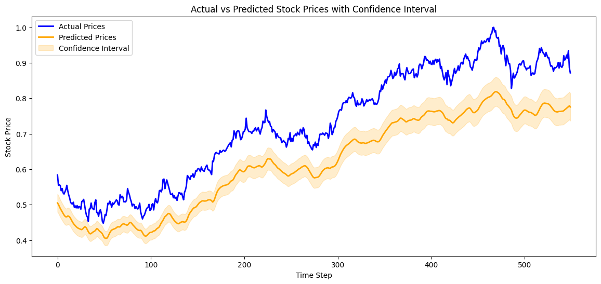
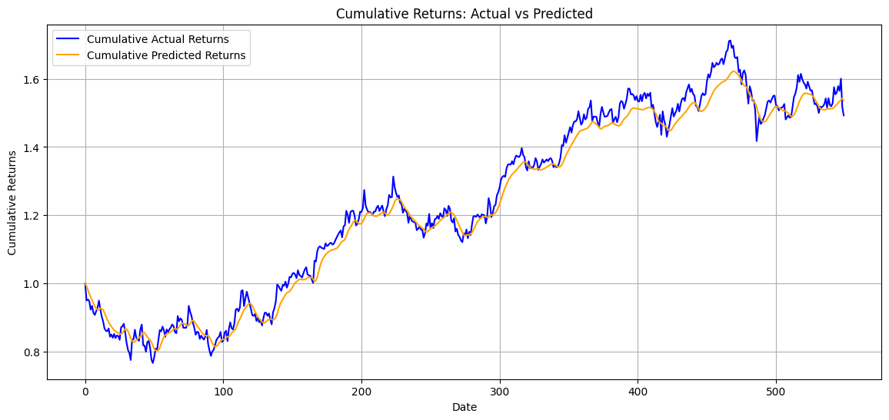
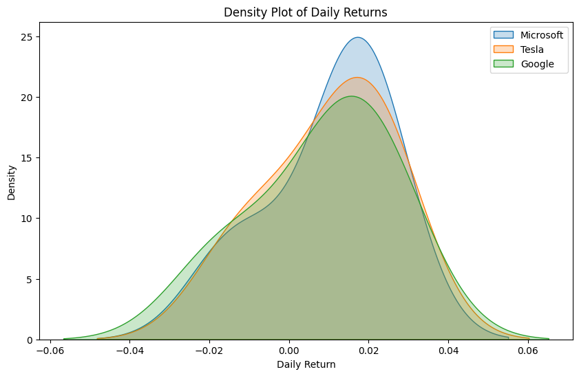
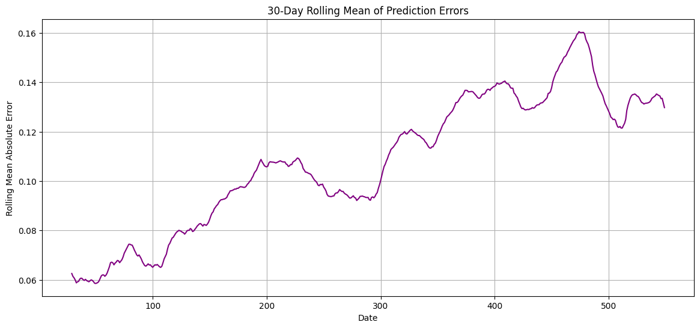
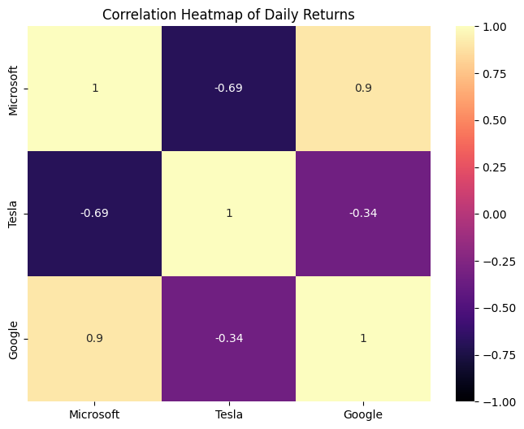
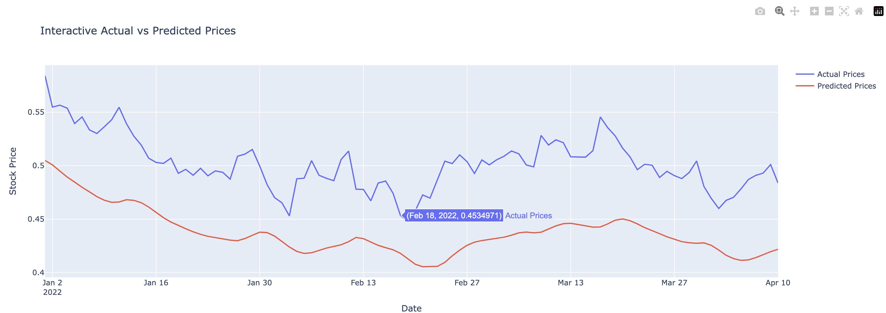
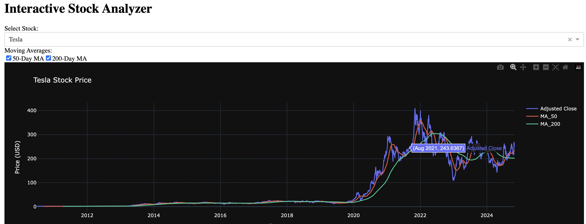

# Stock Price Forecasting Using Deep Learning and Equity Analysis

**Team Bedrock**: Brandon Rusinque, Rasesh Desai, and Erica Yanoshak

## Overview
This project combines traditional equity trading analysis with advanced AI-driven deep learning models to predict stock prices for three major publicly traded companies: Microsoft, Tesla, and Google. The project aims to assess how accurately stock prices can be predicted using a deep learning Long Short-Term Memory (LSTM) model and, optionally, explore the influence of sentiment analysis from news and earnings calls on prediction accuracy.

### Key Questions
1. How accurately can the deep learning model forecast short-term stock prices?
2. Can sentiment analysis from news and earnings calls enhance prediction accuracy?
3. How do market factors such as trading volume and volatility influence stock price predictions?

### Data Sources
* **Historical Stock Data**: Retrieved from Yahoo Finance, covering a year of data for Microsoft, Tesla, and Google.
* **Sentiment Data**: Collected via APIs like Alpha Vantage or FinViz for news and earnings call sentiment.

### Tools and Technologies
* **Programming Languages**: Python
* **Data Libraries**:
  * Pandas (Data manipulation)
  * Matplotlib & Seaborn (Visualization)
  * Deep Learning Framework:
  * TensorFlow & Keras (LSTM model development)
  * KerasTuner (Hyperparameter optimization)
* **NLP Libraries**:
  * Hugging Face Transformers (For NLP sentiment analysis)
  * spaCy or VADER (For sentiment scoring)
  * Whisper (For transcribing earnings calls, if used)
* **Version Control**: Git/GitHub for code management
* **Collaboration**:
  * GitHub Projects (Task tracking and project management)

## Project Workflow
1. **Data Collection & Preprocessing**:
  * Collect historical stock price data and sentiment data
  * Clean and preprocess data, handling missing values and scaling the data for model training
  * Tokenize and preprocess sentiment data (if applicable)

2. **Exploratory Data Analysis (EDA)**:
  * Conduct equity trading analysis using visualizations such as line graphs, heatmaps, and Bollinger Bands to explore trends and volatility
  * Analyze the correlation between stock prices, trading volume, and market sentiment (if applicable)

3. **Model Development**:
  * Build and train the LSTM model using stock price and market data
  * Integrate sentiment data (optional) for enhanced forecasting

4. **Model Evaluation**:
  * Evaluate the model using MSE, RMSE, and MAE
  * Visualize predicted vs actual stock prices

5. **Sentiment Analysis Integration**:
  * Incorporate sentiment data and assess its impact on prediction accuracy
  * Compare model performance with and without sentiment analysis

6. **Model Deployment**:
  * Deploy the model with an interface (e.g., Gradio) to provide stock predictions based on user input.

## Project Structure
* **/data**: Contains raw and processed datasets
* **/notebooks**: Jupyter notebooks for EDA, model training, and evaluation
* **/models**: Saved models and related artifacts
* **/src**: Python scripts for data preprocessing, model training, and evaluation
* **README.md**: This file, containing the project overview and instructions

## Installation & Setup
1. Clone the repository: `git clone https://github.com/TeamBedrock/StockPriceForecasting.git`
2. Install dependencies:
    `pip install -r requirements.txt`
3. Download datasets and place them in the `/data` folder
4. Run Jupyter notebooks in `/notebooks` to explore data and train the models

### Usage
* Run the `data_preprocessing.py` script in the `/src` folder to preprocess data
* Train the LSTM model by running `model_training.py`
* Evaluate the model using the metrics provided in the notebooks

## Results and Conclusion 
### Results
* Visualizations of stock trends and volatility
* Predicted vs actual stock prices
* Impact of sentiment analysis on model predictions

#### 1. Line Plot with Confidence Interval
* Shows the actual vs. predicted prices as line plots with a confidence interval shaded area around the predicted values.
    

#### 2. Cumulative Returns Plot for Actual vs Predicted
* Plotting cumulative returns based on actual and predicted prices helps show the model matches the trends over time.
  
  

#### 3. Density Plot of Daily Returns
* Shows the probability distribution of daily returns, useful for understanding stock volatility.

#### 4. Rolling Mean of Absolute Prediction Errors
* Provides insights into trends in the prediction error over time, smoothing out short-term fluctuations.
  
  

#### 5. Correlation Heatmap of Daily Returns
* Shows the correlation between daily returns for each stock
  
 

#### 6. Interactive Actual vs Predicted Prices Line Plot
* Plotly for Interactive Line Charts, Scatter Plots, and Heatmaps
Plotly is a powerful library that allows for a wide range of interactive plots, including line charts, scatter plots, and heatmaps.

  

#### 7. Interactive Stock Analyzer
* To create an Interactive stock analyzer, we used Plotly Dash to build a web-based interactive applications with sliders, and dropdowns, which allows users to select different stocks, view the stock’s daily prices, and add overlays like moving averages for Microsoft, Tesla, and Google.

### Answers to Our Key Questions
**1. How accurately can the deep learning model forecast short-term stock prices?**
  * With a test loss of 0.0664, a mean absolute error (MAE) of 0.1073, and a mean squared error (MSE) of 0.0125, the deep learning model shows a moderate level of accuracy in forecasting short-term stock prices. The relatively low MSE indicates that the model's predictions are, on average, close to the actual values, while the MAE provides a straightforward interpretation of the average prediction error. 

**2. Can sentiment analysis from news and earnings calls enhance prediction accuracy?**
  * Incorporating sentiment analysis from news articles and earnings calls can potentially enhance prediction accuracy by providing insights into market sentiment and investor behavior, which are influential factors in stock price movements.
    
**3. How do market factors such as trading volume and volatility influence stock price predictions?** 
  * Market factors such as trading volume and volatility significantly impact stock price predictions; high trading volumes often indicate strong investor interest, while increased volatility reflects greater uncertainty, both of which can affect the model's predictive performance.

The results highlight that while the model is useful for providing forecasts that align with actual trends, it may not capture all market nuances, suggesting room for further refinement.

### Conclusion
The conclusion drawn from these results suggests that deep learning models, specifically those using LSTM architecture, can be valuable tools for short-term stock price forecasting. However, integrating additional data sources, such as sentiment analysis or broader market indicators, might enhance predictive performance and mitigate errors, thus offering more reliable guidance for practical investment decisions.

### Future Work & Next Steps:
* Integrating additional features to enhance predictive accuracy and model robustness.
* Incorporating sentiment analysis from financial news articles and earnings call transcripts to provide a deeper understanding of market sentiment and its impact on stock prices. 
* Experimenting with ensemble methods or hybrid models that combine traditional time-series forecasting techniques with deep learning to capture both linear and non-linear patterns.
* Use more advanced hyperparameter tuning strategies and expanding the dataset to include more varied time periods or economic conditions may improve the model’s generalizability.
* Deploying the model through a user-friendly web application for real-time forecasting to enhance accessibility and usability.

## License
This project is licensed under the [MIT License](./LICENSE.txt)

## Libraries Used:
Special thanks to the open-source community for providing these powerful tools.
* Pandas
* NumPy
* Matplotlib
* Seaborn
* Scikit-Learn
* Imbalanced-Learn
* XGBoost
* Plotly
* Dash

## Resources Consulted 
* AI Bootcamp, Models 18 -22. (2023). edX Boot Camps LLC

## Acknowledgements
* This project took advantage of [Xpert Learning Assistant](https://bootcampspot.instructure.com/courses/6141/external_tools/313) to help with coding errors.
* This project utilized assistance from [ChatGPT](https://openai.com/chatgpt), an AI language model developed by OpenAI, for generating code snippets, explanations, and guidance.

